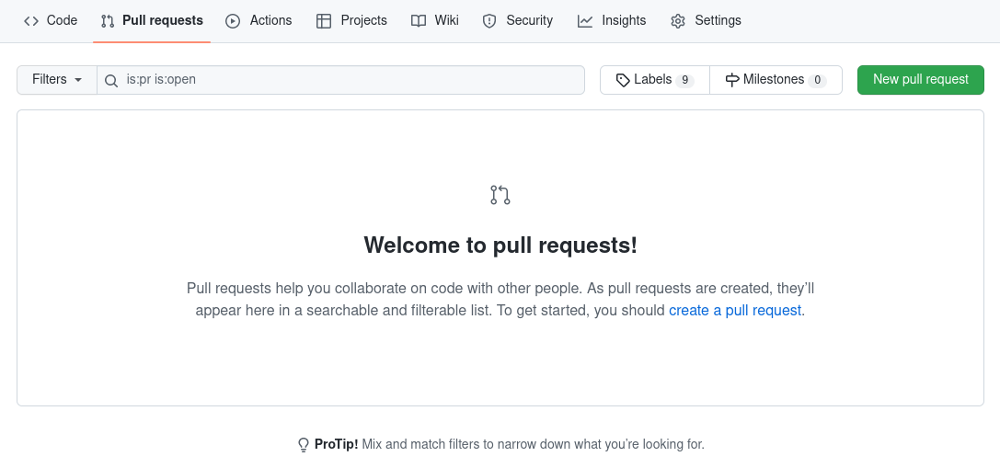
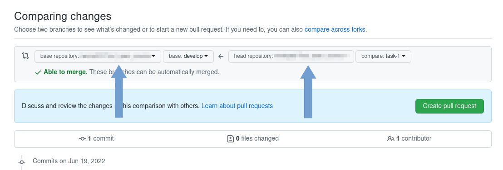
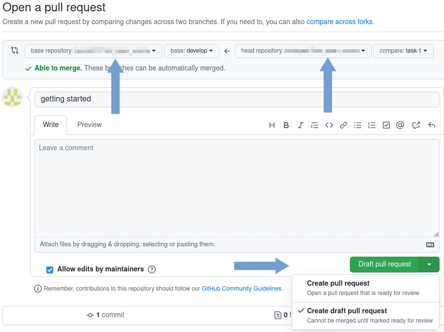
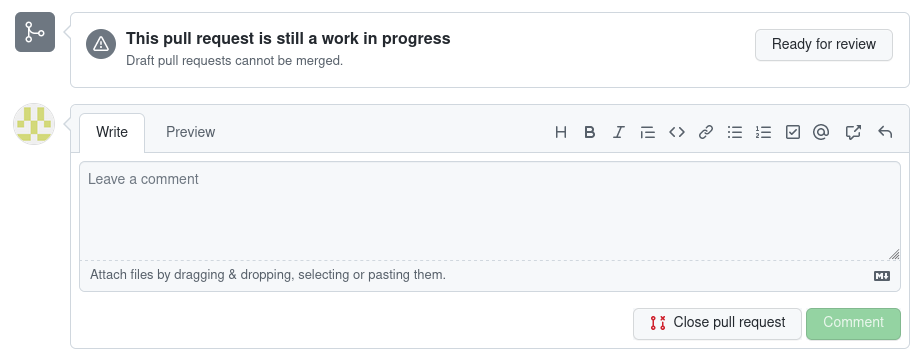

 How we work on GitHub

## Starting work with the task.

1. Go to [our repository](https://github.com/bycza-zagroda/), select backend or frontend and create new fork.


You can leave displayed repository name.

---

2.Expand branches and click link "View all branches".


---

3. Click button "New branch" and fill form as below


Enter a name of new branch and select "develop" as a branch source.

## Local repository
1. Clone your repository

---

2. In local project directory execute commands: (--allow-empty allows us to execute commit without any changes in the project)

```shell
git commit -m "getting started" --allow-empty
git push
```

---

3. Back to your repository on GitHub, click "Pull requests" and "New pull request" button. 



---

4. Select project repository as base repository and "develop" as a base branch. 
Head repository should point to your repository and field compare - new created branch.
Click "Create pull request" button.



---

5. On the next page make sure that you have correctly set branches (devlop in project repository, newly created in yours),
that you selected "Create draft pull request" and click on button "Draft pull request".



---

Now you can start working with the task. 

## Code review

Code review can be started from opened draft pull request. You can open it in several ways, below described one of it.
Go to project page and open "Pull requests" page. Find yours on the list and open it. Next, click the button "Ready for review". 



## Completing work with the task.

After completing work with the task the leaders check that your changes can be merged to upstream. 
If everything is ok, they merged your pull request do devlop branch.
