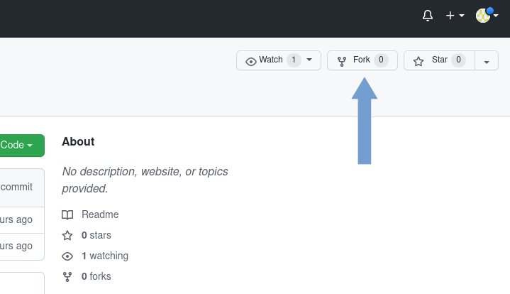

## How we work on GitHub

1. Create new fork from main repository



You can leave displayed repository name.

---

2.Expand branches and click link "View all branches".


---

3. Click button "New branch" and fill form as below


Enter a name of new branch and select "develop" as a branch source.

## Local repository
1. Clone your repository

---

2. In local project directory execute commands:

```shell
git commit -m "getting started" --allow-empty
git push
```

---

3. Back to GitHub, select created branch, next click "Contribuite" and "Open pull request".


---

4. Select project repository as base repository and "develop" as a base branch. 
Head repository should point to your repository and field compare - new created branch.


Make sure that you select "Create draft pull request" and click on it.


## Completing work on the task.
Po zakończeniu pracy nad zadaniem sprawdzamy, czy branch z naszym zadaniem można połączyć z branchem develop. W tym celu należy:
1. logujemy się do githuba i otwieramy repozytorium
2. sprawdzamy, czy branch develop jest aktualny. Jeżeli nie, to klikamy przycisk Fetch upstream → Fetch and merge
3. zmieniamy branch na nasz z zadaniem
4. klikamy przycisk Contribute → Open pull request
5. zmieniamy branch repozytorium głównego na develop, z prawej mamy nasze repozytorium i branch zadania.
6. Sprawdzamy, czy mamy informację „Able to merge”, jeżeli tak, to klikamy View pull request. Otworzy się pull request w repozytorium głównym
7. Klikamy Ready for review
8. 